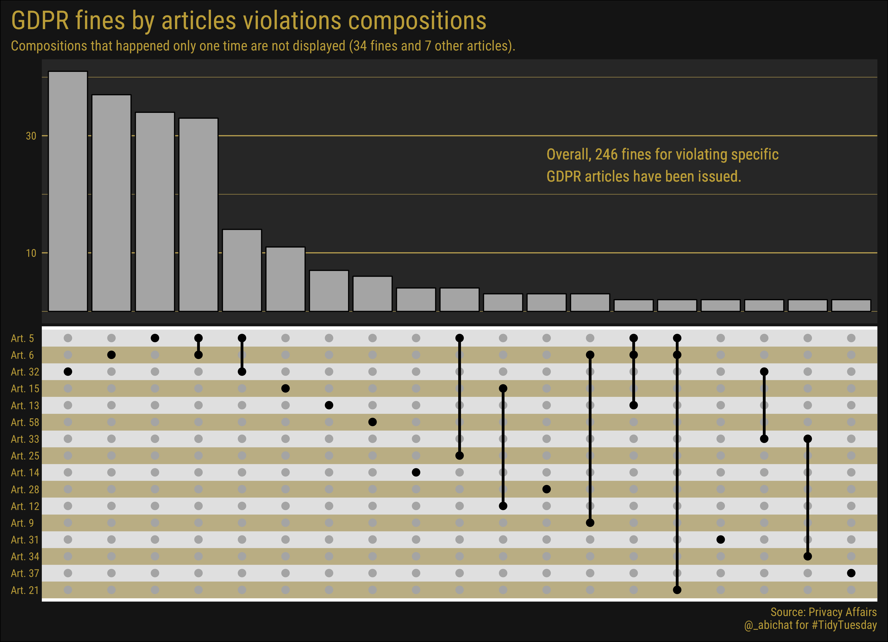
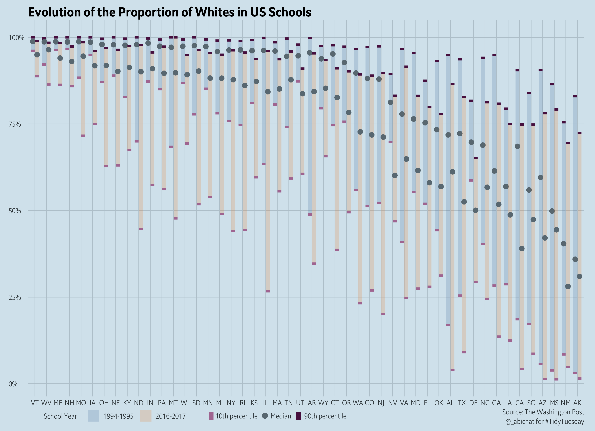
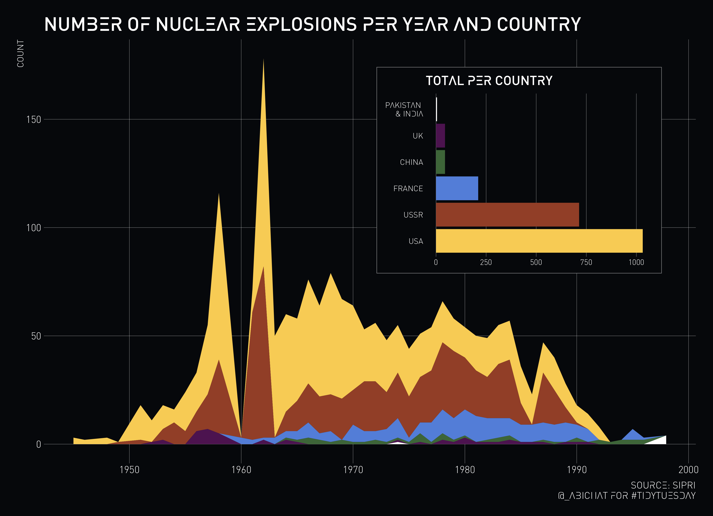
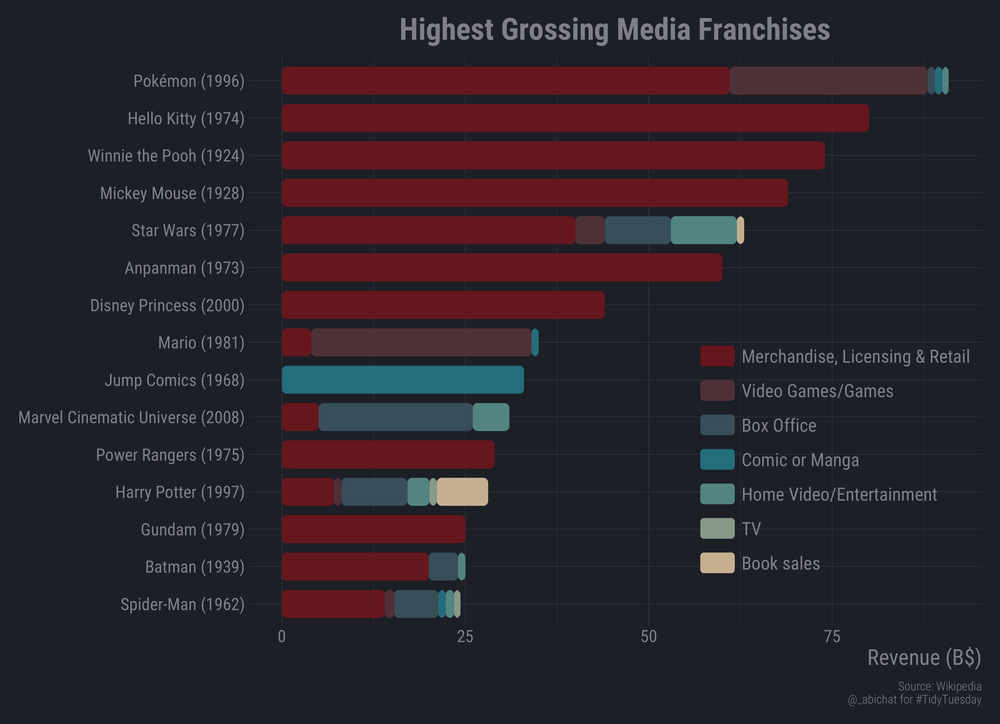

<!-- README.md is generated from README.Rmd. Please edit that file -->

```{r setup, include = FALSE}
knitr::opts_chunk$set(
  collapse = TRUE,
  comment = "#>"
)
```


# tidytuesday <a href='https://github.com/rfordatascience/tidytuesday' target='_blank'></a>


## 2020-05-05 `r emo::ji("hammer")``r emo::ji("leaves")`

<a href='scripts/script_2020-05-05.R' target='_blank'></a>

## 2020-04-21 `r emo::ji("balance_scale")`

<a href='scripts/script_2020-04-21.R' target='_blank'></a>

## 2020-02-18 `r emo::ji("fork_and_knife_with_plate")`

<a href='scripts/script_2020-02-18.R' target='_blank'></a>

## 2019-12-17 `r emo::ji("dog_face")``r emo::ji("us")` 

<a href='scripts/script_2019-12-17.R' target='_blank'></a>

## 2019-12-03 `r emo::ji("car")` `r emo::ji("parking")`

<a href='scripts/script_2019-12-03.R' target='_blank'></a>

## 2019-11-22 `r emo::ji("1234")` `r emo::ji("abcd")` `r emo::ji("capital_abcd")`

<a href='scripts/script_2019-11-12.R' target='_blank'></a>

## 2019-09-24 `r emo::ji("child_light_skin_tone")` `r emo::ji("child_medium_skin_tone")` `r emo::ji("child_dark_skin_tone")`

<a href='scripts/script_2019-09-24.R' target='_blank'></a>

## 2019-08-20 `r emo::ji("bomb")` `r emo::ji("radioactive")`

<a href='scripts/script_2019-08-20.R' target='_blank'></a>

## 2019-07-23 `r emo::ji("airplane")` `r emo::ji("bird")`

<a href='scripts/script_2019-07-23.R' target='_blank'></a>

## 2019-07-02 `r emo::ji("movie_camera")``r emo::ji("moneybag")` 

<a href='scripts/script_2019-07-02.R' target='_blank'></a>

## 2019-06-25 `r emo::ji("alien")``r emo::ji("flying_saucer")` 

<a href='scripts/script_2019-06-25.R' target='_blank'></a>

## 2019-05-28 `r emo::ji("wine_glass")`

<a href='scripts/script_2019-05-28.R' target='_blank'></a>

## 2019-05-21 `r emo::ji("put_litter_in_its_place")`

<a href='scripts/script_2019-05-21.R' target='_blank'></a>

## 2019-05-14 `r emo::ji("woman_scientist_light_skin_tone")``r emo::ji("trophy")`

<a href='scripts/script_2019-05-14.R' target='_blank'></a>

## 2019-05-07 `r emo::ji("man_teacher_light_skin_tone")``r emo::ji("school")`

<a href='scripts/script_2019-05-07.R' target='_blank'></a>

## 2019-04-30 `r emo::ji("bird")`

<a href='scripts/script_2019-04-30.R' target='_blank'></a>

## 2019-04-23 `r emo::ji("dolls")`

<a href='scripts/script_2019-04-23.R' target='_blank'></a>

## 2019-04-09 `r emo::ji("tennis")`

<center>
<a href='scripts/script_2019-04-09.R' target='_blank'></a>
</center>

## 2019-04-02 `r emo::ji("biking_man")`

<a href='scripts/script_2019-04-02.R' target='_blank'></a>

## 2019-03-26 `r emo::ji("dog2")``r emo::ji("cat2")`

<a href='scripts/script_2019-03-26.R' target='_blank'></a>

## 2019-03-19 `r emo::ji("police_car")`

<a href='scripts/script_2019-03-19.R' target='_blank'></a>
